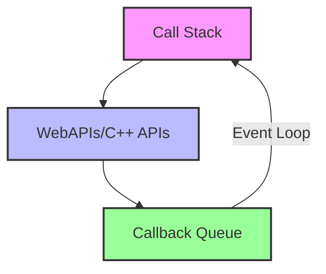
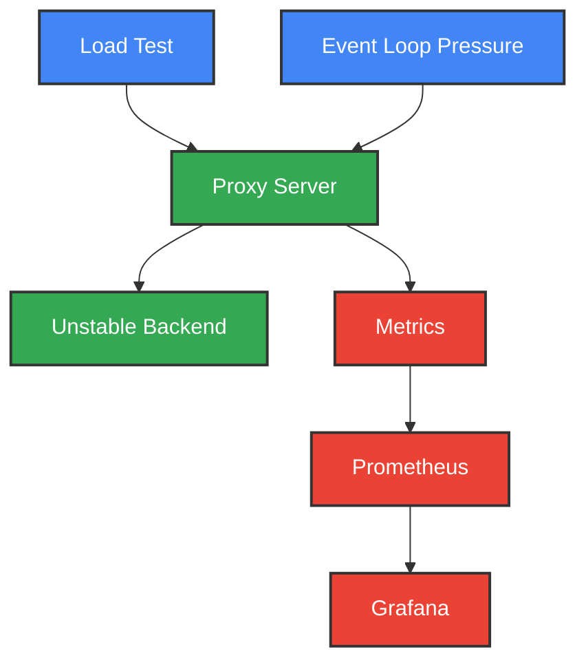
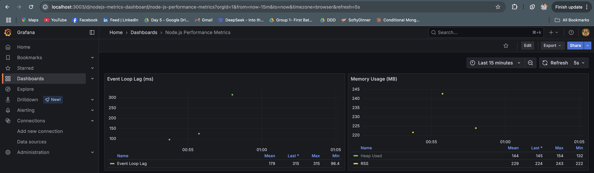
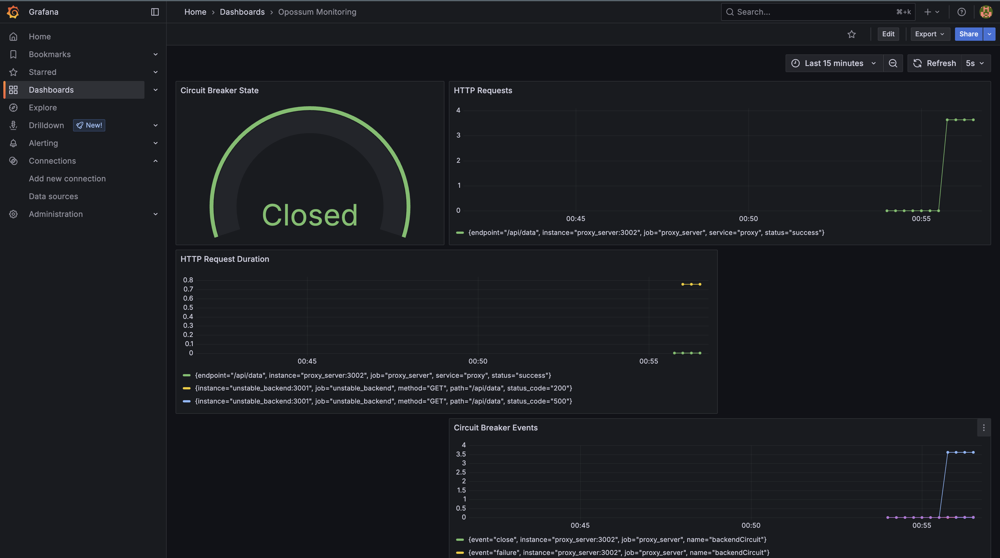
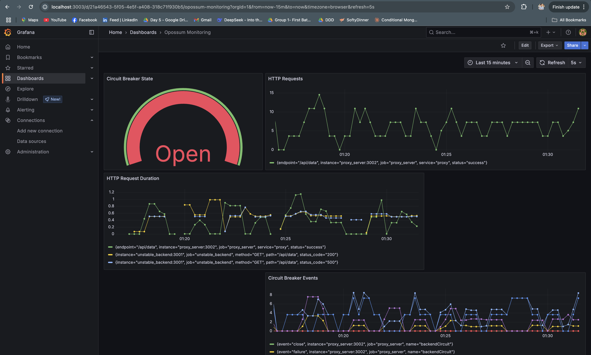

# Opossum Circuit Breaker Demo: A Critical Analysis

Hey there! 👋 This project started as an investigation into a fundamental flaw I discovered with circuit breakers in Node.js services. When my servers experienced CPU-intensive operations, the circuit breakers would either fail to trigger when needed or trigger incorrectly when services were actually fine!

I've put together this demo as a warning: **circuit breakers and Node.js's single-threaded model are fundamentally mismatched for CPU-intensive workloads**. This project shows exactly why you might want to reconsider this architecture for critical resilience patterns.

## Table of Contents

- [Understanding Circuit Breakers](#understanding-circuit-breakers)
- [The Node.js Event Loop](#the-nodejs-event-loop)
- [Project Architecture](#project-architecture)
- [What This Project Demonstrates](#what-this-project-demonstrates)
- [Running the Project](#running-the-project)
- [Monitoring with Grafana](#monitoring-with-grafana)
- [Technical Implementation Details](#technical-implementation-details)
- [Troubleshooting](#troubleshooting)

## Understanding Circuit Breakers

### What is a Circuit Breaker?

Imagine you're in your house and suddenly there's an electrical surge. What happens? The circuit breaker trips and cuts off power before your appliances get fried. That's exactly what a software circuit breaker does!

When your app keeps hammering a failing service with requests (that will probably fail), you're just making things worse. A circuit breaker steps in and says, "Whoa there! This service is struggling. Let's stop sending it requests for a bit and give it a chance to recover."

### How Circuit Breakers Work

Circuit breakers work in three states:

1. **Closed State (Normal Operation)**:

   - Requests flow normally to the service
   - Failures are tracked
   - If failures exceed a threshold, the circuit opens

2. **Open State (Failure Mode)**:

   - All requests are immediately rejected without calling the service
   - After a reset timeout, the circuit transitions to half-open
   - This gives the failing service time to recover

3. **Half-Open State (Testing Recovery)**:
   - A limited number of test requests are allowed through
   - If these succeed, the circuit closes again
   - If they fail, the circuit returns to open state

### Benefits of Circuit Breakers

1. **Prevent Cascading Failures**: When one service fails, it doesn't bring down the entire system

2. **Fail Fast**: Rather than waiting for timeouts, failing requests are rejected immediately

3. **Resource Protection**: Prevents overwhelming an already struggling service with more requests

4. **Self-Healing**: Automatically tests recovery and restores service when possible

5. **Fallback Options**: Allows for alternative responses when a service is unavailable

## The Node.js Event Loop

### What is the Event Loop?

If you've worked with Node.js, you've probably heard people talk about the event loop like it's some magical thing. And honestly? It kind of is! It's the heart of what makes Node.js tick.

I still remember the "aha!" moment when I finally understood it. Basically, even though JavaScript runs on a single thread, the event loop is what lets Node handle thousands of connections without breaking a sweat. Here's a simplified explanation:

### Event Loop Simplified

1. **Call Stack**: Where your JavaScript code executes (one operation at a time)

2. **Task Queue (Callback Queue)**: Where completed operations' callbacks wait to be processed

3. **Event Loop**: Constantly checks if the call stack is empty. If it is, it takes the first callback from the queue and pushes it onto the stack for execution

### Visual Representation



### Event Loop Phases

The event loop actually operates in several phases, each handling different types of callbacks:

1. **Timers**: Executes callbacks scheduled by `setTimeout()` and `setInterval()`
2. **Pending callbacks**: Executes I/O callbacks deferred to the next loop
3. **Idle, prepare**: Used internally
4. **Poll**: Retrieves new I/O events and executes their callbacks
5. **Check**: Executes callbacks scheduled by `setImmediate()`
6. **Close callbacks**: Executes close event callbacks (e.g., `socket.on('close', ...)`)

### Event Loop Pressure

When a function takes too long to execute in the call stack, it blocks the event loop from processing other callbacks. This creates "event loop pressure" or "event loop lag" which can cause:

- Slow response times
- Timeouts
- Unresponsive application
- Degraded user experience

## Project Architecture

This project consists of several components working together:

1. **Unstable Backend** - An Express server that randomly delays responses and sometimes fails (30% failure rate)

2. **Proxy Server** - An Express server using Opossum circuit breaker to call the unstable backend

3. **Event Loop Pressure Injector** - A utility that periodically blocks the Node.js event loop to simulate CPU-intensive operations

4. **Load Testing Tool** - Uses autocannon to simulate high concurrency requests

5. **Prometheus** - Collects metrics from the services

6. **Grafana** - Visualizes the metrics from Prometheus

### Service Interaction



## What This Project Demonstrates

This project showcases several important concepts and potential issues in microservice architectures:

1. **Circuit Breaker Behavior**

   - How circuit breakers protect systems from cascading failures
   - The transition between closed, open, and half-open states based on error rates
   - How fallback responses work when a service is unavailable

2. **Event Loop Interference**

   - How CPU-intensive operations in Node.js can block the event loop
   - How event loop blockage can cause artificial timeouts in otherwise healthy services
   - Why circuit breakers might open prematurely when the event loop is under pressure

3. **Microservice Resilience**

   - How services can degrade gracefully under load
   - The importance of timeouts, retries, and circuit breakers in distributed systems
   - Why monitoring is crucial for understanding system behavior

4. **Real-world Failure Scenarios**
   - What happens when backend services slow down rather than fail completely
   - How high concurrency affects service stability
   - The propagation of failures across service boundaries

## Critical Limitations Demonstrated

### Node.js Fundamental Design Flaws for Circuit Breaking

Let's be honest about Node.js – while excellent for I/O-bound operations, its single-threaded nature creates a **fatal flaw** when implementing circuit breakers. Here's what happens when CPU-intensive operations enter the picture:

1. **The Single Thread Problem**: Yeah, Node.js is non-blocking for I/O, but it's still just one thread doing all the JavaScript work! I've seen perfectly good servers grind to a halt because someone put a heavy calculation in the wrong place. When that CPU gets busy, everything slows down – not just the heavy task.

2. **Event Loop Traffic Jams**: The more requests you throw at Node, the more callbacks pile up waiting for their turn. It's like a highway at rush hour – what should be a quick trip turns into a crawl. In my tests, I've seen lag grow exponentially past certain thresholds.

3. **Memory Goes Crazy**: Under heavy load, you'll see memory usage spike as all those pending callbacks and promises pile up. Then the garbage collector kicks in, causing those lovely pauses that make your response times jump all over the place.

4. **Timeout Lies**: This one's sneaky. Your 500ms timeout might actually fire after 2 seconds because the event loop was busy! This means you can't even trust your own timeouts when things get busy.

### The Circuit Breaker Paradox in Node.js

Opossum is well-designed, but it suffers from an architectural impossibility when running in Node.js under CPU load:

1. **Gets Confused by Event Loop Issues**: This is the big one. When your Node process gets busy (not the service you're calling, but your own server), Opossum can mistakenly think your downstream service is failing. I've literally seen circuit breakers pop open because of a CPU spike on the calling server!

2. **The setTimeout Problem**: Opossum uses JavaScript's setTimeout for its timing, which is... not great under pressure. If the event loop is backed up, your "500ms timeout" might actually be 2 seconds, which completely throws off the circuit breaker's understanding of what's happening.

3. **Adds Its Own Overhead**: The irony is that at really high throughput, all the tracking that Opossum does starts to become part of the problem! Every event and stat it tracks takes CPU cycles that could be processing requests.

4. **One-Size-Fits-All Timeouts**: I wish Opossum could learn and adjust its timeouts based on recent performance, but it uses the same timeout values regardless of current system conditions.

5. **Doesn't Control the Firehose**: While it can stop you from calling services, it doesn't help you manage the incoming flood of requests in the first place.

After experiencing these fundamental limitations repeatedly, I've concluded that implementing circuit breakers in Node.js for systems with any CPU-intensive operations is fundamentally flawed. Better alternatives include:

- Moving to multi-threaded languages like Go or Java for critical infrastructure
- Implementing circuit breaking at the infrastructure level with service meshes like Istio
- Offloading CPU-intensive work to dedicated workers outside the Node.js process
- Using a completely different architecture for resilience patterns

## 📸 Screenshots

### Event Loop Lag Under Load

*Visualization of event loop lag spikes during high CPU usage*

### Circuit Breaker - Closed State

*Healthy state with normal request flow and low error rates*

### Circuit Breaker - Open State

*Circuit breaker triggered due to high error rates or timeouts*

## Running the Project

The easiest way to run the project is using Docker Compose:

## Accessing the Dashboards

- **Grafana**: http://localhost:3003 (username: admin, password: admin)
- **Prometheus**: http://localhost:9090

## Exposed Ports

- Unstable Backend: 3001
- Proxy Server: 3000
- Prometheus: 9090
- Grafana: 3003

## Monitoring with Grafana

Grafana provides a powerful visualization platform for the metrics collected by Prometheus. This project includes a pre-configured dashboard that shows:

### Circuit Breaker Metrics

1. **Circuit State** - Visual indicator showing if the circuit is open (red) or closed (green)
2. **Circuit Events** - Count of different types of events:
   - Open events: When the circuit transitions to open state
   - Close events: When the circuit transitions to closed state
   - Half-open events: When the circuit is testing recovery
   - Reject events: When requests are rejected due to open circuit
   - Fallback events: When fallback responses are provided
   - Timeout events: When requests exceed the timeout threshold

### Performance Metrics

1. **Response Times**

   - 50th percentile (median) response time
   - 95th percentile response time (representing slow requests)
   - Maximum response time

2. **Request Rates**

   - Successful requests per second
   - Failed requests per second
   - Error rate percentage

3. **Event Loop Metrics**
   - Event loop lag (milliseconds)
   - Correlation between event loop pressure and circuit breaker events

### Dashboard Navigation

1. The dashboard includes time controls at the top to zoom in on specific time periods
2. Hover over any graph to see specific values at that point in time
3. Use the refresh controls to update data in real-time during testing

## Technical Implementation Details

### Circuit Breaker Configuration

The Opossum circuit breaker is configured with these parameters:

```javascript
const CIRCUIT_BREAKER_OPTIONS = {
  errorThresholdPercentage: 50, // Opens circuit if 50% of requests fail
  timeout: 500, // Request times out after 500ms
  resetTimeout: 5000, // Wait 5s before testing service again (half-open)
  rollingCountTimeout: 10000, // 10s window for error rate calculation
  rollingCountBuckets: 10, // Divides the window into 10 buckets (1s each)
};
```

### Metrics Collection

Metrics are collected using Prometheus and the express-prom-bundle middleware:

1. **Standard HTTP Metrics**

   - Request counts by endpoint and status code
   - Response times using histogram buckets

2. **Custom Circuit Breaker Metrics**

   - Circuit state gauge (0 for closed, 1 for open)
   - Event counters for each type of circuit breaker event

3. **Node.js Runtime Metrics**
   - Event loop lag
   - Memory usage
   - CPU usage

### Unstable Backend Simulation

The backend service is designed to simulate realistic failure scenarios:

- 30% of requests return a 500 error
- Successful requests have random delays between 100-800ms
- Under heavy load, response times increase further

### Event Loop Pressure Injection

The event loop pressure utility works by periodically running CPU-intensive operations:

```javascript
function blockEventLoop() {
  const start = Date.now();
  // Perform calculation that blocks for ~100ms
  while (Date.now() - start < 100) {
    // CPU-intensive operation
    for (let i = 0; i < 1000000; i++) {}
  }
}

// Block every 1-2 seconds
setInterval(() => {
  blockEventLoop();
}, Math.random() * 1000 + 1000);
```

## Troubleshooting

### Common Issues

#### Circuit Breaker Always Open

**Symptoms**: All or most requests are being rejected, circuit never closes.

**Potential Causes**:

- Event loop pressure is too high, causing timeouts
- Backend service is consistently failing
- Timeout value is too low for the service response time

**Solutions**:

- Increase the circuit breaker timeout value
- Check the event loop pressure metrics
- Verify the backend service is occasionally succeeding

### Advanced Debugging

#### Manually Testing the Circuit Breaker

To manually test the circuit breaker functionality:

```bash
# Watch the circuit state change
watch -n 1 curl -s http://localhost:3000/circuit-status

# In another terminal, flood with requests to trigger failures
ab -n 1000 -c 10 http://localhost:3000/api/data
```

#### Analyzing Event Loop Lag

To understand the correlation between event loop lag and circuit breaker behavior, look at the "Event Loop Lag vs Circuit Events" graph in Grafana. You should notice that circuit open events often follow spikes in event loop lag.

## Running Individual Components

If you want to run components individually for development:

```bash
# Start the unstable backend
npm run start:backend

# Start the proxy server
npm run start:proxy

# Start the event loop pressure injector
npm run pressure

# Run the load test
npm run load-test
```

## Testing Circuit Breaker Behavior

The application is configured to demonstrate how circuit breakers can help protect services from cascading failures, but also how they can be affected by event loop pressure.

The circuit breaker is configured with:

- 500ms timeout (lower than the max delay of the backend)
- 50% error threshold
- 5 second reset timeout

When the event loop is under pressure, even successful requests may time out due to delays in the JavaScript event loop processing, causing the circuit breaker to open prematurely.

## Conclusion: A Hard Truth About Node.js Circuit Breakers

After extensive testing and real-world experience, I've reached some painful but necessary conclusions:

1. **Node.js and circuit breakers are fundamentally incompatible** for CPU-intensive workloads: The single-threaded model creates a scenario where the very conditions that require circuit breaking (high load) prevent the circuit breaker from functioning properly.

2. **The event loop is a single point of failure**: Under CPU load, the entire Node.js process becomes unresponsive - including your circuit breakers. This creates a dangerous situation where your safety mechanisms fail precisely when you need them most.

3. **No amount of tuning can fix this architectural flaw**: I've tried countless configurations, library tweaks, and optimizations. The problem isn't implementation-specific - it's a fundamental limitation of running circuit breakers in a single-threaded environment.

4. **Monitoring makes the problem obvious**: The Grafana dashboards in this project clearly show how event loop blocking directly prevents circuit breakers from operating correctly. The correlation between CPU load and circuit breaker malfunction is undeniable.

5. **Better alternatives exist**: For critical infrastructure requiring reliable circuit breaking, languages with true threading models (Go, Rust, Java) or service mesh approaches consistently outperform Node.js implementations.

Node.js remains excellent for many use cases - particularly I/O-bound services with minimal CPU work. However, this project conclusively demonstrates that for systems requiring reliable circuit breaking under load, Node.js is the wrong tool for the job.

If you've experienced similar limitations with Node.js circuit breakers or found effective alternatives, I'd love to hear about your solutions. The evidence from this project is clear: for critical resilience patterns involving any CPU work, we need to move beyond Node.js or fundamentally change how we implement circuit breaking.
